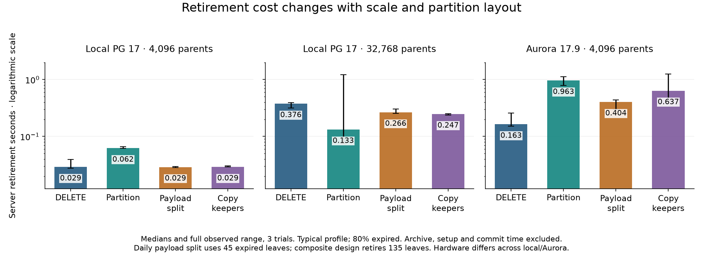
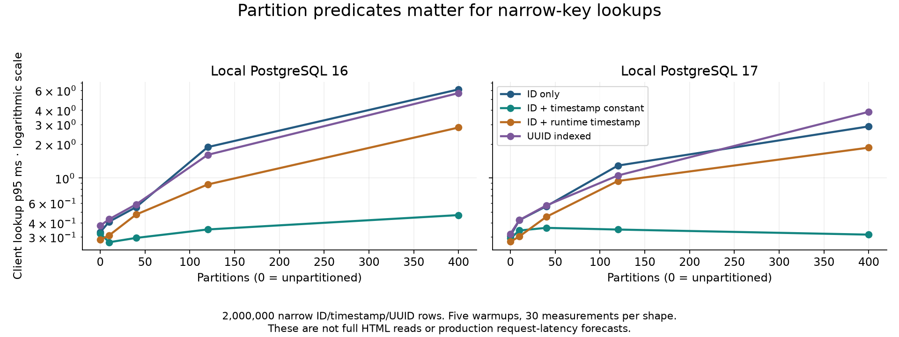

# Source-shaped Aurora retention study

This study reconstructs the supplied sanitized parent and queue schemas and tests the three proposed architectures plus a copy-keepers backlog migration. It provides measured comparisons, reproducible generators, an EF sample, and archive fidelity checks. It does **not** establish a production completion time for the approximately 100-million-row backlog.

The evidence supports continuing a measured backlog cutover investigation and treating the long-term key design as a separate decision. It does not support promising an order-of-magnitude gain from a narrow identity table. At the small measured scale, indexed DELETE is competitive; partition retirement gains depend on row count, the number of partitions retired, and the application/operational changes required to use it safely.

- [Complete performance tables](performance-tables.md): every configuration, with individual trials in CSV.
- [Compressed evidence and hash manifest](../../evidence/workload-report/manifest.json): engine versions, settings, plans, archive receipts, and exact-content verification outcomes.
- [Reproduction and measurement methods](../../benchmarks/README.md).
- [Canonical baseline DDL](sanitized-schema.sql) and [EF model](../../samples/Retention.Workload/Model.cs).

## What came from the supplied use cases

The three supplied documents were source material for schema facts, observed code behavior, estimates, and hypotheses. They were not treated as authority to execute their suggested production changes. Original attachments and their internal-to-generic name mapping are excluded from this repository.

Both original tables have **17 columns**. The generic reconstruction retains their types, nullability, defaults, identity behavior reported in the subsequent review, and the following relationships.

| Source fact | Reconstruction | Boundary |
| --- | --- | --- |
| Parent ID-only bigint key; scheduled/expiry/created timestamps; recipient varchar(10) | All original columns in `notification_event` | Generic names; no production identifiers |
| Parent message varchar(1000), subject varchar(100), HTML varchar(10485760) | Same SQL limits, including NULL/empty cases | varchar limit counts characters; the boundary test uses 10 MiB ASCII |
| Parent UUID, smallint state, template int, three text channels, nullable target timestamp/JSON, int remaining minutes | Same SQL types and nullability | Default/generated values exercised separately from explicit deterministic fixture IDs |
| Queue ID-only bigint key, parent/template IDs, text body, subject, required JSON/bool, timestamps, state, HTML/channels/JSON | All 17 queue columns | Composite option adds `parent_scheduled_at` as an 18th column |
| Queue → parent and push → parent cascade | Both FKs and supporting nonunique indexes | Complete source index inventory not supplied; index presence is a controlled assumption |
| Parent/queue → template cascade | Both FKs | Minimal synthetic template payload, not an invented complete work template schema |
| Queue navigation claims 1:1, database FK is not unique | `HasOne.WithOne` with no new database UNIQUE constraint | Benchmark uses one queue per parent; earlier compatibility probes cover the mismatch |
| History references queue ID without an FK | Soft ID plus index; explicit history cleanup | Retention policy modeled as parent-aligned; independent history policy remains a decision |
| Parent scheduled timestamp unmodified in reviewed code; queue scheduled timestamp mutable | Queue time diverges; composite child retention key copies parent time | Perf DDL is a quiescent fixture, not the immutable-trigger/fencing implementation from phase 8 |
| ID and external UUID lookups; EF relationships and rescheduling | Full-row reads, joined/split navigation loads, tracked update/rollback, key-plan matrix | Work's exact EF/Npgsql versions, raw writers and interceptors remain unconfirmed |
| Legacy archive lacks template table | Fixture archives template explicitly | Demonstrates a repair choice; does not claim legacy archives already have it |

Unknown push/history/template payload columns use explicitly minimal definitions. Their structural relationships are represented, but their full byte distributions are not known. Existing sanitized inputs were reused; the remaining work-side request is for specific missing deltas, not the same schema package again.

## Datasets and environments

The source-shaped retention matrix uses 4,096 parents, 4,096 queues, 12,288 push rows in typical/tail profiles or 15,944 under skew, 1,024 history rows, and one template. It retires 3,276 parents (about 80%) and preserves 820. Larger local runs use 16,384 parents with the tail profile and 32,768 parents with the typical profile (172,033 rows across the complete graph), with the same proportional generator. All data is deterministic and synthetic.

The supplied parent HTML range was typically 5–50 KB with occasional 200 KB–1 MB bodies. The generator cycles through 5/10/20/30/50 KiB, with tail stress frequencies of approximately 4% at 200 KiB and 1% at 1 MiB before NULL/empty rules. Typical measured parent HTML mean is about 22.2 KiB among non-NULL values, with p50 20 KiB and p95 50 KiB. Queue bodies cycle through 3/4/6/8 KiB. NULL and empty values, quotes, newlines, UUIDs, and nested JSON are preserved. The actual distributions and physical sizes are in the tables, not inferred from the source's row-size estimates.

The skew scenario assigns 40 pushes to roughly 5% of parents and two to other parents. Fanout frequency, one queue per parent, 80% expired fraction, and age distribution are assumptions. HTML has repeated markup and deterministic tokens, so its TOAST compression is not a measurement of work's actual content.

Expired dates occupy 45 daily buckets; the future bucket covers the fixture's live dates. Logical observation time is October 31, with an October 1 cutoff, independent of the execution date. This models clearing a 45-day expired backlog while preserving a broad future bucket, not steady-state retirement of one day with 30–40 live daily partitions. After retirement, the broad future bucket is the only remaining payload leaf; narrow identity cleanup may behave differently with many remaining payload leaves. Monthly partitions are not silently substituted for the daily design recommended by the revised review.

| Layer | Environment / denominator | What it isolates |
| --- | --- | --- |
| Full-schema local retirement | PostgreSQL 16.15 and 17.11, Docker, 2 CPU cap, 4 GiB memory, temporary filesystem | Keys, payload/cascade work, archive/restore, physical storage and local WAL |
| Full-schema cloud retirement | Existing private Aurora PostgreSQL 17.9, 0.5–1 ACU ceiling | Aurora execution and actual S3 CSV round-trip; Data API client overhead |
| Query/partition matrix | 2,000,000 narrow ID/timestamp/UUID rows per tested layout; 0/10/40/120/400 partitions | Planning/pruning/index sensitivity, not two million full HTML records |
| EF / BenchmarkDotNet | Local 16/17, .NET 10, EF 10.0.4, Npgsql provider 10.0.2 / driver 10.0.3, BDN 0.15.8 | Full materialization, graph loading, allocations, pooling/preparation, tracked update |
| Migration probes | 4,096 parents; 20,040 child rows backfilled per trial | Child timestamp backfill, constraint establishment, physical row movement, retry behavior |
| Archive boundaries | Four full parent/queue rows plus related rows | 10 MiB ASCII body, Unicode, NULL/empty, corruption rejection |

There is no Aurora 16 deployment or comparative Aurora 16 performance claim. Local data lives on a RAM-backed temporary filesystem and does not reproduce the work instance's storage I/O constraint. Local CPU/RAM, filesystem and network differ from Aurora; engine columns must not be read as a controlled hardware-normalized version race.

## Designs and measurement semantics

`delete` archives expired logical rows, then commits indexed parent DELETE batches with cascades and explicit soft-history cleanup. `partition` archives the same logical rows, cleans history, drops expired child leaves, then detaches/drops parent leaves. There are 45 expired leaves per related partitioned table, or 135 leaves total. It does not use `DROP ... CASCADE` as a substitute for row cleanup.

`split` moves seven wide parent fields to a side table while retaining the ID-only parent key and existing child FKs. Its original aggregate variant has one historical payload partition. The separate `split_daily` sensitivity uses 45 historical payload leaves, matching the parent granularity in the composite design. Both drop payload leaves, then still delete narrow identities with queue/push cascades. Queue payload remains wide. This is not a claim that the entire cascading graph has become narrow.

`copy` archives expired rows, creates a keeper schema with the declared keys/FKs, copies survivors, advances identity sequences, renames the schemas, and compares all survivor columns. The old synthetic schema is removed only after verification. The timed copy section covers rebuild and swap; later deletion of the retained old schema is post-verification cleanup and is not included in that timing. Reported post-retirement storage is the active design schema only, excluding archive/keeper scratch copies and the retained old schema; it is not peak coexistence storage or an Aurora bill. This is a quiescent schema-swap rehearsal; it is not an online production table swap or a complete grants/triggers/RLS migration.

Every arm starts with identical original logical values, established by bidirectional `EXCEPT ALL`. All five relations are exported and re-imported, then compared the same way. Local export is binary COPY through bounded temporary staging; cloud export uses S3 CSV and checks SSE-KMS. Archive verification precedes retirement. Survivor content is checked after retirement commits.

**The archive transaction commits before retirement starts.** No writers exist between those transactions in this fixture. It cannot safely be deployed as an online archive-and-delete controller without the fencing and durable reconciliation work described in earlier phases. The new benchmark is not a replacement for those correctness tests.

Server retirement time covers the timed DML/DDL statements. Client retirement includes transactions, RPCs, commit calls, and measurement queries. Archive transaction time includes export, import and exact verification. Initial fixture construction and copy-into-design are separate. All three-trial values are retained, including slow trials; medians and ranges are reported, not a p95 computed from three values. A standalone query p95 uses 30 measurements after five warmups and has correspondingly limited statistical precision.

Local WAL deltas are cluster-wide statement deltas, not per-row guarantees, commit-inclusive totals, or Aurora billed write I/O. Checkpoints/full-page writes and background work can alter them. Aurora's tested WAL counters are unavailable and remain null. Physical post-DELETE file size is not equivalent to remaining live data: ordinary DELETE does not immediately shrink files.

## Findings supported by the measurements

### Indexed DELETE, daily payload split, and backlog copying

On local PostgreSQL 17, the 4,096-parent typical fixture's median server retirement times were about 0.029 s for indexed DELETE, 0.029 s for daily payload split plus identity/cascade cleanup, 0.029 s for copy-keepers, and 0.062 s for composite partition retirement. At this scale, dropping 135 small leaves has visible metadata cost. This does not contradict partitioning's bulk-retirement benefit at much larger per-leaf row counts.

The larger local 16,384-parent tail case moved the comparison: medians were approximately 0.191 s DELETE, 0.108 s partition retirement, 0.131 s copy-keepers, and 0.105 s aggregate payload split. The aggregate split has one expired payload leaf and must not be described as the daily split result. Its slow trial remains in the evidence. These measurements are useful scale sensitivity, not a 100M-row extrapolation.

On Aurora 17.9, the same typical 4,096-parent case had median server retirement times of 0.163 s DELETE, 0.963 s composite partition retirement, 0.637 s copy-keepers, and 0.189 s aggregate payload split. Client retirement was 5.220/1.828/1.108/5.513 s respectively. The inversion between server and client rankings reflects the different number of Data API/transaction calls; it is not evidence that row deletion consumes more server time than those partition DDL operations. Full archive transaction medians were about 35–37 s, much larger than retirement itself, using intentionally small 256-ID export chunks and exact verification. That per-request overhead is part of this safety-oriented fixture, not a tuned maximum S3 throughput result.

The 32,768-parent typical case provides a comparison using the daily payload layout: local 17 median server times were 0.376 s DELETE, 0.133 s composite partition retirement, 0.266 s daily payload split, and 0.247 s copy-keepers. The partition trials ranged from 0.074 to 1.220 s, including a slow trial that was not discarded. This supports scale sensitivity, not a tight latency guarantee. The parent/queue relation sizes alone totaled about 399 MiB before retirement; the full graph totaled about 425 MiB and each trial archived roughly 774 MiB of binary COPY data.

The cloud daily payload-split supplement measured 0.404/0.418/0.478 s median server retirement for typical/tail/skew, with approximately 5.8–6.0 s client retirement. The aggregate historical-payload result is therefore not substituted for the daily layout in the comparison charts.

The measured daily split does **not** establish the proposed 10× identity-cleanup improvement. It still pays for child cascades and narrow-row deletes. In the local typical case, statement WAL median fell from about 1.95 MB for DELETE to 1.38 MB for daily split, while server duration was effectively similar. That is a bounded observation, not a universal cost ratio.

The no-FK-index sensitivity on local 17 increased typical DELETE median server time from approximately 0.029 s to 1.035 s (about 36×). This is evidence that checking the actual referencing-column indexes matters; it does not diagnose the work instance from afar. Batch sizes 64/256/1024 produced approximately 0.033/0.029/0.024 s server medians, while smaller batches paid more client/commit overhead. A work-side safe batch size must also account for lock duration, timeout, WAL and replica behavior.

Copy-keepers materially reduces the active file footprint in this fixture: for the local typical dataset, the active schema went from about 46.8 MiB to 9.6 MiB. DELETE left approximately 46.8 MiB of relation files. Copying incurs keeper insert/index WAL and needs temporary coexistence space; it is not zero-cost. Production rollback after accepting new writes would require replay/reconciliation, not merely retaining the old table.

### ID lookups, pruning, and application costs

In the local 17 two-million-row narrow matrix, ID-only client p95 increased from about 0.308 ms unpartitioned to 2.873 ms at 400 partitions. A direct ID-plus-timestamp constant stayed about 0.292–0.315 ms at those endpoints. The runtime timestamp expression had a materially different planning cost (about 1.861 ms client p95 at 400 partitions). The report retains that expression as a distinct shape; it is not evidence that every apparently timestamp-qualified query prunes equally.

Aurora's two-million-row matrix also completed all 25 cases. At 400 partitions, client p95 was approximately 746.7 ms for ID-only versus 101.0 ms for the direct timestamp-bound form. These figures include Data API behavior and are not Npgsql/proxy forecasts. The retained representative EXPLAIN planning/execution times are separate observations; subtracting one representative plan from a request p95 would not establish a p95 network overhead.

An unindexed external UUID lookup scanned the narrow data and had client p95 around 50–57 ms locally. Adding the UUID index greatly changed that result. Indexing each partition still does not create global UUID uniqueness. Work must separately decide whether UUID uniqueness is a contract, and whether queries can carry the retention key.

Full-row EF measurements do not simply equal the narrow planner test. On local 17 without auto-preparation, baseline parent-by-ID averaged 0.623 ms; the partitioned ID-only form averaged 0.931 ms, while the partition-qualified read averaged 0.626 ms. Graph loading allocated roughly 160–180 KB per operation in this selected 100-row mix. Joined versus split query behavior and auto-preparation varied by case; neither configuration was a universal winner. All 24 cases per version, including allocations and standard deviations, are published.

Npgsql retains prepared statements on pooled physical connections, and automatic preparation is a configurable behavior. These results use a single pooled physical connection per benchmark case and a declared threshold; they do not simulate RDS Proxy or work's full pool. [Npgsql prepared statements](https://www.npgsql.org/doc/prepare.html).

The EF benchmark invokes 100 operations per iteration, with one launch, three warmup iterations and ten measured iterations. Default BenchmarkDotNet outlier treatment can leave fewer than ten retained values. Its means and standard deviations describe per-operation estimates from those iterations, not individual-request p95 latency. [BenchmarkDotNet jobs](https://benchmarkdotnet.org/articles/configs/jobs.html).

### Backfill and mutable scheduling

Local 17 backfilled 20,040 child rows in approximately 0.0675 s median server time, with about 13.1 MB statement WAL. The add-column and constraint steps are reported separately. This is a measured mass-update cost, but it does not establish that a work-scale backfill will be faster or slower than its existing deletes. The fixture builds the supporting parent unique index nonconcurrently and does not claim an online migration rehearsal.

Rescheduling selected 410 queue rows. Under a mutable delivery-time partition key, 328 crossed a physical boundary; with a parent-aligned retention key, none moved. Local 17 observed about 1.09 MB versus 0.43 MB statement WAL in that comparison. Both local versions reproduced SQLSTATE `40001` when a concurrent updater hit a row moved to another partition, and then successfully retried in a new transaction. This matches the documented row-movement conflict behavior. [PostgreSQL UPDATE](https://www.postgresql.org/docs/17/sql-update.html).

Aurora backfilled the same 20,040 child rows in 0.289 s median server time. Its scheduling probe also moved 328 of 410 selected rows under the mutable key and zero under the parent key, with 0.107 s versus 0.009 s server durations in that single scheduling comparison. Aurora WAL is unavailable, and the concurrent wire-protocol 40001 collision remains a local-only proof.

The mitigation is to separate mutable delivery scheduling from the parent retention key, together with an explicit immutability rule for that parent key. It does not eliminate the need for transaction-level retry handling in the application.

## Corrections to the supplied research

| Claim needing correction or qualification | Evidence-based correction |
| --- | --- |
| Partitioned identity parents require PostgreSQL 17 | Parent-directed GENERATED ALWAYS inserts work in tested 16.15 and 17.11. Direct-leaf inheritance/enforcement differs; see the executed [version matrix](../version-matrix.md). No need to weaken the parent to a plain `nextval` default based on that claim. |
| PostgreSQL 17 provides native SPLIT/MERGE PARTITION for this migration | `SPLIT PARTITION` is rejected on both tested engines. Use tested supported migration operations; do not build the runbook around screenshot syntax. |
| Adding a composite key itself rewrites the heap or converts the table | Key/index establishment and conversion to partitioning are separate operations. An ordinary table cannot be switched in place to declarative partitioning; copying or attaching requires a distinct design. |
| Every backfilled row always rewrites all indexes and must cost more than DELETE | UPDATE creates row versions, but HOT can avoid new index entries when eligibility and page-space conditions hold. The benchmark measures its own result; the general speed/WAL comparison is not predetermined. |
| NOT VALID means new writes remain unprotected until VALIDATE | The new FK is enforced for new/changed rows. Validation checks existing rows. An actual constraint-free gap depends on transaction/cutover sequencing, not simply use of NOT VALID. |
| Monthly partitions impose a 60-day minimum for 30-day retention | A fully expired monthly bucket can yield roughly 30–61 days per row, plus job cadence. Daily buckets reduce granularity slack to roughly a day. This is date arithmetic, not a different retention policy. |
| Composite child partitions cannot enforce one queue per logical parent | UNIQUE(parent_id,parent_timestamp) can enforce one queue per composite parent if it includes the child's partition key. Global bare parent-ID uniqueness remains a separate issue. |
| Composite keys preserve global ID/UUID identity | Pair uniqueness does not enforce bare-ID/UUID uniqueness across timestamps. A separate unpartitioned identity registry is an architectural alternative; it adds work and is not supplied by a shared sequence. |
| ID-only/state-only forms always have a fixed plan or prune time partitions | ID-only access lacks a time bound; actual node choice depends on costs/statistics. A state predicate alone supplies no scheduled-time bound. Inspect each real plan. |
| pg_partman always requires its background worker | Manual maintenance is supported; AWS documents scheduling maintenance with pg_cron. Enabling pg_cron can itself require parameter-group/restart work. |
| Partition retirement is universally constant-time, near-zero WAL | Metadata/lock/FK work scales with the retirement layout; archive read/export/verify remains real work. Timings and local WAL in this report are nonzero. |
| Keeping the old table makes production cutover rollback trivial | It is a pre-new-write fallback. After new writes, rollback needs an explicit replay/reconciliation strategy. |

Sources: [PostgreSQL partitioning](https://www.postgresql.org/docs/17/ddl-partitioning.html), [ALTER TABLE](https://www.postgresql.org/docs/17/sql-altertable.html), [HOT updates](https://www.postgresql.org/docs/17/storage-hot.html), [Aurora pg_partman maintenance](https://docs.aws.amazon.com/AmazonRDS/latest/AuroraUserGuide/PostgreSQL_Partitions.html). The local version matrix supplies direct execution evidence for the version-specific claims; the source documents' labels were not accepted as proof.

## Acceptance status and practical decision

| Requested proof | Status | Evidence / remaining limit |
| --- | --- | --- |
| 1. Version and identity behavior | Measured locally; cloud boundary explicit | 16.15/17.11 matrix; Aurora 17.9 only |
| 2. Composite relationships and cascade behavior | Measured in fixtures | Prior phases plus all-column graph comparisons; all unknown work references are not inventoried |
| 3. Exact S3 export/restore before retirement | Measured on synthetic lab | Full relations, contents and encryption checked; no seven-year compliance certification |
| 4. Mutable delivery time separate from parent key | Measured | 328 physical moves versus zero in selected scenario |
| 5. Query cost at 10/40/120/400 partitions | Measured on narrow projection | Direct constants, runtime expressions, ID and UUID forms; full EF measured separately |
| 6. Cross-partition update, WAL and retry | Measured locally; cloud WAL unavailable | Actual 40001 and successful new-transaction retry; no proxy/failover proof |
| 7. Child backfill cost | Measured at 20,040 child rows | Three trials with columns/UPDATE/constraint phases; no production-scale rewrite forecast |
| 8. Narrow identity cleanup improves 10× | Not established | Daily/aggregate payload split measured; cascades remain significant |
| 9. Copy-keepers cutover | Quiescent rehearsal passed | Declared keys/FKs, identity sequences and survivor contents; production grants, catch-up and post-write rollback not covered |
| 10. Archive failure/corruption does not authorize retirement | Bounded proof | Earlier rejection/fencing tests plus full-schema corruption rejection; new performance harness is not an online recovery controller |
| 11. Global identity and soft-history ambiguity | Constraint limitation demonstrated | Earlier duplicate-ID tests fail closed; global identity contract still requires a design decision |

For the **backlog**, first reconcile the supplied index and cascade structure with the real query plan and measured IO/WAL evidence. If a controlled cutover window is feasible and the survivor set is small, copy-keepers remains a strong candidate to evaluate because it avoids row-by-row removal of the discarded majority. Complete and verify the required archive first, rebuild all actual dependencies, and rehearse catch-up/rollback where writes must continue. The small lab does not select a production instance size or forecast elapsed time.

For **future retention**, Option A is appropriate only if composite identity and the associated ORM/writer changes are accepted. Parent-aligned daily partitions address mutable queue time, but ID-only queries, global identity, history policy and prepared-plan fencing still matter. Option B preserves the ID-only FK contract but requires payload-write/read changes and still has row-level child cleanup. Its proposed 10× gain remains unproven. Option C keeps the current schema and is the lowest-change route while actual index and IO bottlenecks are established.

Missing production evidence is specific: complete incoming-FK/index/trigger inventory beyond the supplied tables, aggregate fanout/payload/age distributions, actual work SDK/EF/Npgsql and proxy configuration, concurrent writer/query shapes not already represented, vacuum/replica/IO behavior under sustained load, cutover downtime allowance, history/template retention semantics, and restore SLA. These are bounded follow-ups to the material already received.

## Verification and observed cloud context

The published manifest contains 23 successful run receipts: **168 retirement trials**, **75 query cases**, **48 EF benchmark cases**, **9 backfill trials**, six scheduling comparisons, and three full-schema archival boundary runs. The latter verified all five logical relations on each engine and rejected same-count content corruption. All retirement arms verified archive contents before retirement and exact survivors afterward. Local retry collision tests passed on both versions; no Aurora wire-protocol retry claim is made.

Repository verification passed 21 unit tests plus three benchmark harness cleanup tests, and the new .NET project built in Release with no warnings or errors. Rebuilding tables from the committed manifest verifies the compressed and uncompressed receipt hashes and rejects incomplete/ambiguous outcomes. Commands are in the benchmark README.

The read-only CloudWatch snapshot covers a four-hour window with mixed lab activity, not isolated trial attribution. Capacity ranged from 0.5 to 1 ACU; CPU reached 100% during that window, so these runs do not demonstrate spare production headroom. The table retains CPU, capacity, memory, buffer-hit and volume-I/O observations with units and period counts. Neither CloudWatch aggregates nor local WAL are presented as an Aurora invoice.

## Operational handoff and evidence limits

No infrastructure is added by these experiments. They use the existing private, capped Aurora lab and synthetic run-owned schemas/S3 objects. The user-confirmed teardown reminder is **October 9, 2026 at 1 PM America/Chicago**. It is a reminder, not automatic deletion. The existing $50 total-lab spending constraint remains in effect; measured database timings are not a cost bill or an extrapolated production budget.

Raw application logs and source attachments stay outside Git. The published receipts are selected successful experiments, not a complete log of exploratory failures: an initial SDK login dependency failure was fixed before AWS data work, and preliminary smoke/older query/EF runs are excluded in favor of the stated complete configurations. Execution happened in a working tree; receipt hashes bind the recorded bytes, not an attestation that every run executed the final Git commit. Later harness changes improved cleanup and failure-state recording without changing the completed experiments' timed SQL.

The report makes no claim about a 100M-row completion time, seven-year archive durability/compliance, production RDS Proxy behavior, Aurora failover, general online migration safety, or full work-application compatibility. Those claims require their own evidence.
